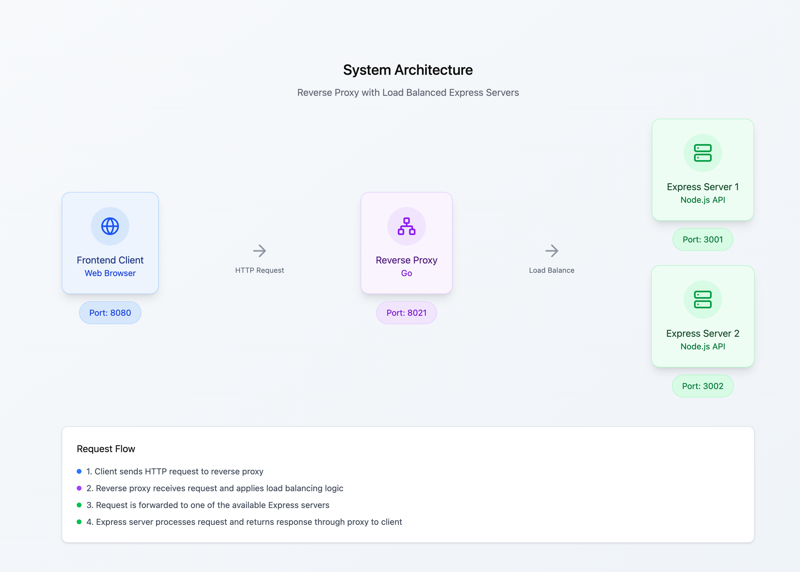

# ✅ To-Do – Availability PoC

## Backend (Primary + Backup Services)
- [x] Setup repository (`availability-tactics-demo`)
- [x] Initialize backend (Node.js/Express, un seul `server.js` piloté par `ROLE` + `PORT`)
- [x] Implement service endpoints:
  - [x] `GET /health` → check if service is alive
  - [x] `GET /api/data` → return sample payload (message différent selon `primary`/`spare`)
  - [x] `POST /fail` → simulate **real** failure (`process.exit(1)`)
  - [ ] `POST /recover` → (facultatif) non requis avec Docker `restart`
- [x] Dockerfile (image Node 18-alpine, `npm ci --omit=dev`)

## Reverse Proxy (Failover Manager)
- [x] Initialize reverse-proxy (Node.js/Express, Python/Flask, or Java/SpringBoot)
- [x] Implement proxy endpoints:
  - [x] `GET /proxy/health` → check active service
  - [x] `GET /proxy/data` → forward request to active service
  - [x] `POST /proxy/fail` → forward fail trigger to primary
  - [x] `POST /proxy/recover` → forward recover trigger to primary
- [x] Background job:
    - [x] Monitor `/health` of primary → auto-switch to backup if down (`setInterval`)
  - [ ] Log downtime + recovery events
  - [ ] Optionally collect metrics (failover time + error rate)
- [x] Dockerfile

## Front-End (Monitoring UI)
- [ ] Initialize front-end (any stack: React, Vue, or simple HTML/JS)
- [ ] Features:
  - [ ] Logs section (show requests + failures)
  - [ ] Schema of the architecture (visual diagram)
  - [ ] Animation when connection switches from primary → backup
  - [ ] Display metrics (failover time + error rate) (optional)
- [ ] Dockerfile

## Deployment
- [x] Docker Compose:
  - [x] 2 backends (primary + backup)  avec `healthcheck`
  - [x] 1 reverse proxy
  - [ ] 1 frontend

## Deliverables
- [ ] Architecture document (2–3 pages)
- [ ] Demo video (3–5 minutes):
  - [ ] Normal operation
  - [ ] Trigger failure
  - [ ] Show detection + failover
  - [ ] Recovery
  - [ ] Metrics (if bonus)

## Bonus
- [ ] Collect metrics:
  - [ ] Failover time (`T_bascule`)
  - [ ] Error rate during failover (`E_bascule`)

## Getting Started with Docker Compose

  To start the entire project stack using Docker Compose:

  ```bash
  docker compose up --build
  ```

  This command will:
  - Build all service images (backend, reverse proxy, and frontend if available)
  - Start the containers as defined in `docker-compose.yml`
  - Automatically restart services if they fail (per healthcheck and restart policies)

  To stop and remove containers, networks, and volumes:

  ```bash
  docker compose down
  ```

  > **Tip:** Use `docker compose logs -f` to view real-time logs from all services.

## Architecture

